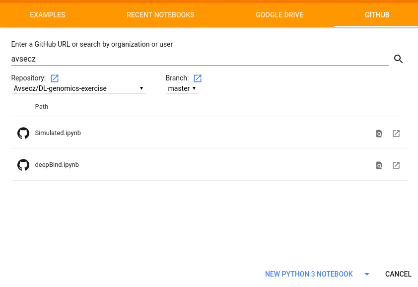

# DL-genomics-exercise
Jupyter notebooks for the system genetics lecture exercise 11 thought at TUM

## How to use this notebook with colaboratory:

1. Visit https://colab.research.google.com/
2. Select github -> avsecz -> DL-genomics-exercise -> Simulated.ipynb

4. Once you have the notebook, select to use the GPU: Edit -> Notebook settings -> Hardware accelerator = GPU