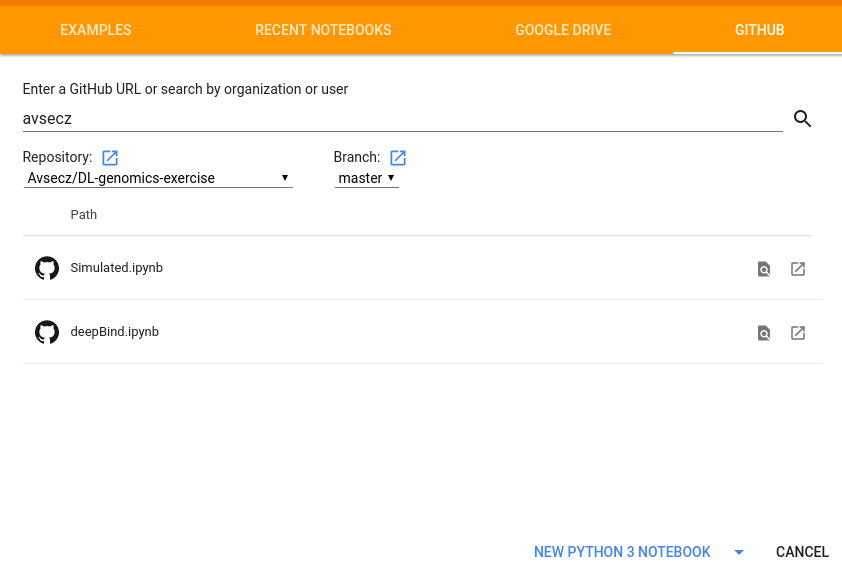

## How to use this exercise with colaboratory 

1. Visit https://colab.research.google.com/
2. Select github -> avsecz -> DL-genomics-exercise -> Simulated.ipynb
3. Select 'New python 3 notebook'

4. Once you have the notebook, select to use the GPU: Edit -> Notebook settings -> Hardware accelerator = GPU

One they are done with this lecture, they should select the DeepBind.ipynb notebook.